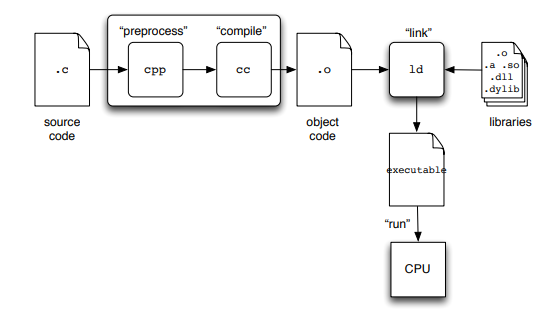

# C

## Sections

- [Basic Structure](./Notes/Basic-Structure.md)
- [IO](./Notes/IO.md)
- [Data Types](./Notes/Data-Types.md)
- [Strings](Notes/Strings.md)
- [Math in C](Notes/Math.md)
- [Flow Control](Notes/Flow%20Control.md)
- [Functions](Notes/Functions.md)
  - [Variable Storage Class (Scope)](Notes/storage_class.md)

## Why C?

1. A C program runs in a much smaller memory footprint (embedded systems).
2. Because C programs run with less support, they may also run faster. 
3. Is the universal interchange language. 

## C process

## Others

- [C for Java Programmers](https://www.cs.rochester.edu/u/ferguson/csc/c/c-for-java-programmers.pdf)

