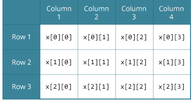
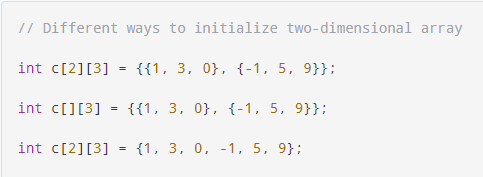

# Arrays in C

Arrays are defined as a collection of variables of the same data type.

They are declared like normal variables but with `[]` after the name. Then the size is specifed (and fixed) either explicitly or implicitly by initializing the array directly:
```c
int example[15];
int example2[] = {1,2,3,4,5};
```
> Uninitialized arrays contain random values (garbage)

In order to access a value: 
```
example[0]
```

## Size of an array
To determine the size of an array in C, the following construct has to be used, using the `sizeof` [operator](https://juan-castrillon.github.io/self-learning-notes/C/Notes/Varables-in-memory.html#Sizeof):

```c
int array[5];
int size = sizeof(array)/ sizeof(array[0]);
```

## Memory

Considering the example: 
```c
float mark[4];
```
The addresses of the values will be consecutive according to the size of the type.

Suppose the starting address of `mark[0]` is `2120d`. Then, the address of the `mark[1]` will be `2124d`. Similarly, the address of `mark[2]` will be `2128d` and so on. This is because the size of a float is 4 bytes.

## Multidimensional Arrays

Used to represent more complex data structures, can be seen (in 2d) as an array of arrays. Where the first bracket corresponds to the rows and the second to the columns.

```c
int grid[2][3];
```



This is clear when initializing it



> Stings are array of `char` types. So a 2D `char[][]` corresponds to a 1D String array. Where the first size is the number of strings and the second, the length of the biggest string plus one (for the `\0` character)
> ```c
> char names[5][9] = {
>		"Ant",
>		"Bee",
>		"Cat",
>		"Duck",
>        "Elephant"
>	};
> ```


## Arrays in functions

Arrays (an multi-dim Arrays) can be passed as arguments to functions normally
```c
void function(int[] array);
void function2(int[][] array);
```
However, in C **you cannot return arrays from functions**.


