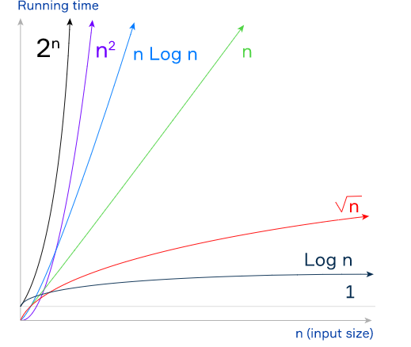

# The big O Notation

## Time and space complexity

We use the **big O notation** to classify algorithms according to how their running time or space (e.g., disk memory) requirements increase depending on the input size. It does not depend on programming language, operating system, hardware, your programmer skills, and other specific implementation details. Knowing **big O notation** enables you to find the best algorithm (in terms of time and memory requirements) for a specific task.

First, let's examine the time complexity of an algorithm in the **big O notation**.

In this notation, the time complexity of an algorithm is written as $O(T(n))$

- $T(n)$ is a time complexity function that describes how the running time of an algorithm increases depending on the input size $n$;
- the symbol $O$ means that, when the input is large enough, the running time increases at most proportionally to the function inside parentheses. $O$ stands for Order of (for example $O(n^2)$ is read "Order of the square of n").

The **big O notation** has one essential advantage. It describes the upper bound of the function growth rate. In other words, it describes the worst-case scenario for our algorithm. In practice, an algorithm may work even better than big O shows, but not worse.

## Common growth rates

Below are, from best to worse, some common values of the big O function for the time complexity. Note that the space complexity of an algorithm (how memory requirements increase depending on the input size) is measured in the same way. For example, if an algorithm has $O(n)$ (linear) space complexity, the required memory increases proportionally to the input size.

- $O(1)$ (constant time). The number of required operations does not depend on the input size. Examples: accessing array element by index, calculating the sum of arithmetic progression using the formula, printing a single value.

- $O(\log n)$ (logarithmic time). The number of required operations is proportional to the logarithm of the input size (the base of the logarithm does not matter). Example: binary search in a sorted array.
  
- $O(\sqrt n)$ (square root time). The number of required operations is proportional to the square root of the input size.
  
- $O(n)$ (linear time). The number of required operations is proportional to the input size, i.e., time grows linearly as the input size increases. Often, such algorithms are iterated only once. Examples: sequential search, finding array maximum/minimum.
  
- $O(n \log n)$ (log-linear time). The running time increases proportionally to $n \log n$.
  
- $O(n^2)$ (quadratic time). The number of required operations is proportional to the squared input size. Examples: simple sorting algorithms such as bubble sort, selection sort, insertion sort.
  
- $O(2^n)$ (exponential time). The number of required operations depends exponentially on the input size. In other words, the running time increases proportionally to $2^n$.

The following picture demonstrates these complexity functions (without $O$).

As you see, an algorithm with the time complexity $O(n)$ is better than an algorithm with the time complexity $O(n^2)$ because the linear function grows slower than the quadratic one. However, an algorithm with the complexity $O(\log n)$ is better than both of them. The algorithm with the complexity $O(2^n)$ may need too much time to solve a problem even for a small input size. As a rule, we don't use such algorithms in practice. The best one is an algorithm with the $O(1)$ time complexity, because it's running time does not increase with the input size at all.

## Conclusion

The big O notation is an essential instrument for algorithm performance evaluation. We can use it to evaluate both time and memory complexities. The greatest advantage of the big O notation is that it classifies an algorithm rather than gives you a real running time in seconds or required memory in megabytes.