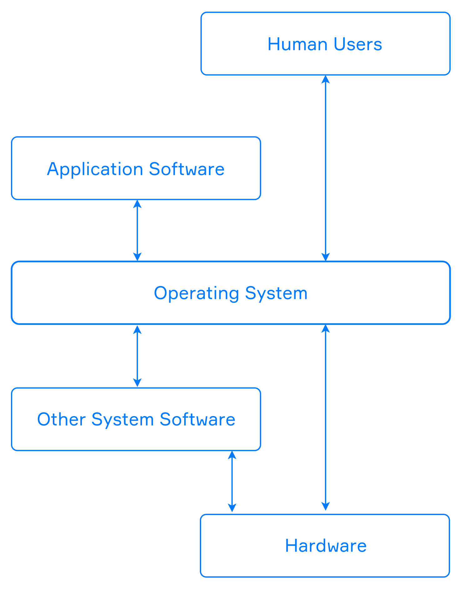
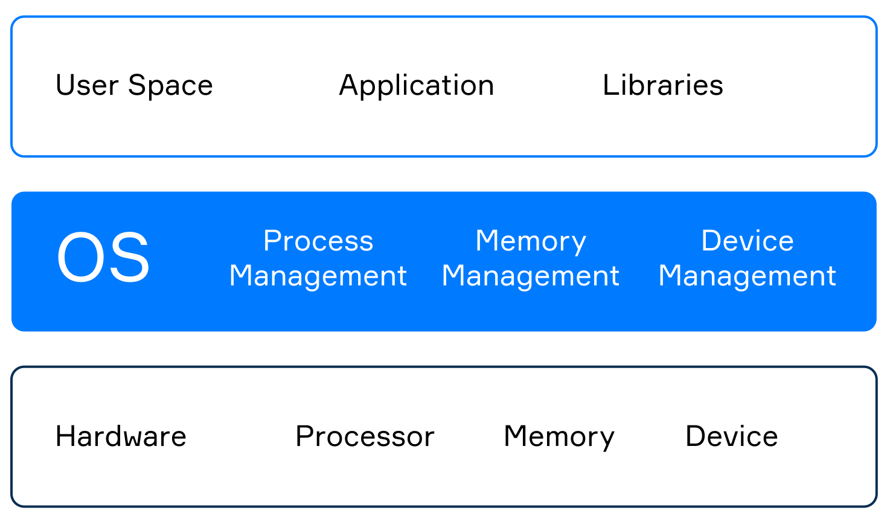

# Operating system
An operating system (OS) is a set of software that manages communication between all other applications and hardware. It turns a computer into something more than just a bunch of metal parts, a complex system that can effectively perform different tasks.

Nowadays, there exist a lot of operating systems for you to choose from. For personal computers, the most popular ones are Microsoft Windows, macOS, and Linux distributions. The two top mobile operating systems are Android and iOS. If you've ever heard of smart kettles and smart fridges, even they have their own OS.

Of course, the operating systems for such a range of devices differ greatly from one another. What they have in common are the means they provide to the programs and those who use them.

> On the one hand, it's only an illusion that your favorite browser is the same on Windows as it is on macOS. On the other hand, you can run the same application on different computers with the same OS.

## Functions of the OS
An operating system controls the communication between all the computer software and hardware. An OS can give programs restricted access to processor units, memory, hard drives, network, peripherals, and other resources.

You can run a browser, a media player, and ten other applications, and your OS is the one giving them all the resources they need to run properly. At the same time, this OS acts as a fair referee prohibiting any application to take up more resources than it actually needs.

As a mediator between the applications and hardware, the operating system allows us to communicate with the device without going into details about its specificity or mechanics.

Any operating system has several essential functions. Here is a list of some of them:

- data protection and secure access;
- resource management;
- interaction between hardware and peripherals;
- file management;
- running other programs.
  
It is possible to distinguish more functions of modern operating systems, but those listed above are enough for starters.

## Operating systems' components
A mandatory part of all operating systems, its core, is the kernel. Usually, it's one of the first programs that load when you turn on your computer. It provides all the necessary means to run the programs you want.

Typically, when you start your OS, you see the Graphical User Interface (GUI). It is the type of interface that allows users to interact with the device using graphical icons and audio indicators. Another way to interact with the OS is to use commands in a text-based terminal known as Command Line Interface (CLI).

There are two types of kernels, known as monolithic kernel and microkernel. The monolithic kernel is a large program that performs most of the OS functions. At the same time, the microkernel performs only a small subset of the operating system functions, but we can extend it with additional modules known as drivers.

There are other important parts of the operating system besides the kernel and the graphical user interface. We will review them in the next topic. For now, use the following image to brush up everything we've covered so far:

