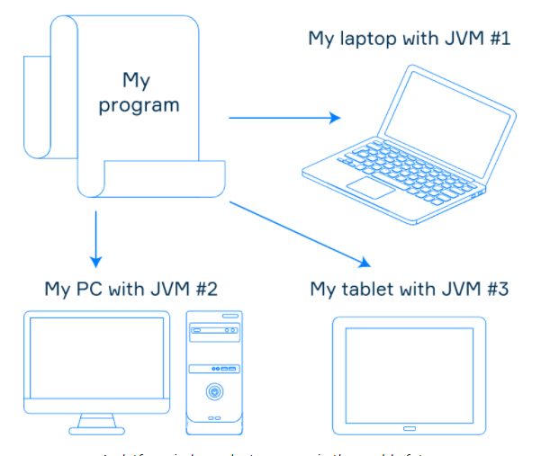

# Java Platform

Even if you are not an experienced programmer, you've probably heard something about Java. In fact, the term "Java" is used for many purposes in the world of software development: it doesn't only mean the programming language. In general, Java refers to a software platform: it includes some computer applications and documentation. In this topic, we'll go over a few essential ideas about Java and understand why it is so widely spread in the world of development.

## JVM

Programs in the world of Java run via a special application called Java Virtual Machine, or JVM. It is usually a separate program installed on the device. In short, JVM represents a virtual computer that corresponds to the JVM specification document. Different platforms have different JVMs, but since all JVMs match the same specification, a program run in different JVMs can behave identically: from the point of view of the program, nothing changes.

It is one of the main concepts of Java Platform: write once, run anywhere. It means that a single program can run on different computers thanks to JVMs installed there. So the most programs in the world of Java aren't bound to a device. This concept is also frequently called platform-independence, or portability.

## JVM languages 

Java Platform allows using more than one programming language to create programs. This is achieved by the design of JVM: it doesn't know anything about any particular programming language. It can understand only Java bytecode, a representation of a program in a very compact form. If the tools for a programming language can generate Java bytecode, programs written in the language can run using JVM. Such languages are often called JVM languages. They include Java itself, Kotlin, Scala, Groovy, Clojure, and others. So to create programs in the world of Java, you can choose the most convenient language for you.

> Nowadays you can find tools to generate Java bytecode for almost any programming language, which means that there's hardly any language that is not a JVM language.

Don't be afraid of that "bytecode generation". It may sound difficult, but in most cases, programmers don't do that manually. It's done automatically by special applications called compilers, and you don't even need to be able to read or modify bytecode if you don't want to. Bytecode is needed mainly to provide a common language for JVM to understand, so humans don't usually need to worry about this. If necessary, you can manage bytecode with special tools like ASM framework or Javassist library.

## Conclusion

In this topic, we learned about two main components of the Java Platform, JVM and JVM languages. JVM languages have tools that produce Java bytecode. JVMs are separate for different computer devices but they all can run Java bytecode in the same way, making programs in the world of Java platform-independent. All this makes Java Platform overwhelmingly diverse and handy for many different use cases.