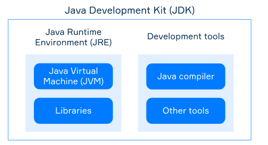

# JVM, JRE and JDK

Several basic Java Platform terms that often confuse beginner programmers are **JVM**, **JRE**, and **JDK**. Abbreviations might be hard to remember and tell apart at first, but getting familiar with them will help you feel more at ease with development for Java Platform.

## Java Virtual Machine (JVM)

JVM is a virtual simulation of a physical computer. It executes Java bytecode class files (as you remember, we usually get such files by compiling a source code file of a JVM language). JVMs are available for many hardware and software platforms, so you can run Java bytecode almost everywhere. A program compiled to Java bytecode is almost always platform-independent.

Today there is a variety of JVM implementations. For instance, HotSpot is the primary reference Java VM implementation.

## Java Runtime Environment (JRE)

JRE is an execution environment for running compiled JVM programs. JRE includes Java Virtual Machine (JVM) and Java Class Library (JCL).

JCL consists of many libraries including input/output, collections, security, classes for parsing XML, user interface toolkits, and many others. Your program can use these libraries.

When you run your compiled program in JRE, JVM uses bytecode class files of both your program and JCL.

## Java Development Kit (JDK)

JDK is a package to develop programs for Java Platform. It includes JRE (so you can also run your programs) and tools for developers, such as Java compiler, debugger, archiver, etc.

Java compiler (usually it's the `javac` tool) translates `*.java` into `*.class`. Several files with `*.class` extension can be packed together in a single Java Archive (JAR-file).

Other JVM languages such as Kotlin or Scala have their separate compilers, they aren't bundled with JDK.

## The relationship between JVM, JRE, and JDK
The following image illustrates the relationship between JVM, JRE, and JDK:

To recap, remember these abbreviations:

- JVM executes Java bytecode;
- JRE includes JVM and standard libraries: it is needed to run compiled programs;
- JDK includes JRE and development tools: it is needed to develop programs. As a developer, you need to install JDK.

> Before Java 11, if you wanted only to run a Java program, JRE was enough for you. However, since Java 11 was released, for most JVM implementations JRE is no longer downloadable as a separate component. If you want to run programs in JVM 11 or newer, you have to install JDK.