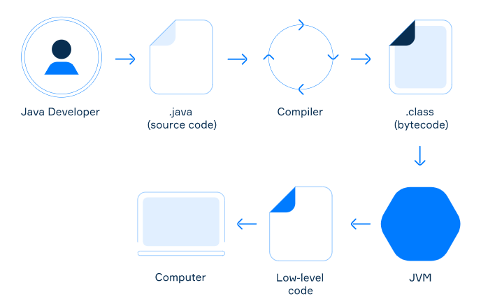

# Write compile and run

In this article, you will get an overview of how to write a program in Java world and how to run it. In the upcoming topics, this knowledge will help you create a new program and run it on your computer.

## Writing a program

To create a new program, developers first write its code known as the source code. The source code is a text stored in one or several files, it is a sequence of instructions that specify what the program actually does. It must follow the syntax rules of the language and it needs to be easy to understand for humans.

As a programmer, you will write code in a plain text file. It will be a file with the `.java` extension for Java language, `.kt` for Kotlin, and so on. A single program consists of one or more of these files.

## Compilation

As soon as a program is written and we have one or more source code files, we must somehow make a computer run this program. But there is an issue: computers are not able to understand source code. Fortunately, there are special programs called **compilers** that transform source code into a format that the computer understands. This code is called a native code or a low-level code.

There are many types of computers in the modern world: mobile devices based on Android OS, personal computers (or PCs), laptops, servers, and so on. But there is a problem: each type of computer works with different low-level codes just like people speak various distinct languages.

There is a solution to this problem in the world of Java. A compiler (for example, `javac` tool for Java or `kotlinc` tool for Kotlin) translates source code into the intermediate representation known as **Java bytecode**, which is stored in files with `.class` extensions. The bytecode can't be used with real computers but a special abstract computer called Java Virtual Machine (or JVM) can execute it.

## Running a program

Before running a JVM program, an appropriate distribution of JVM should be installed on the computer. Each operating system has its special version of JVM. At the same time, JVM can execute a program written in a JVM language regardless of the type of operating system (or OS) and hardware, so the program that has the same low-level representation can be run on Windows, Linux, Mac OS, and other platforms. This also means that a program written and compiled on one platform can be run on another platform if a suitable JVM is installed. This makes programs written in JVM languages **platform-independent**.

To run a compiled program, you will use the `java` tool. It can open a file with the `.class` extension to launch a program represented by this file. This part is similar for all JVM languages: for example, for Kotlin you will still use the `java` tool.

## The general view

This picture shows a simplified process of writing, compiling, and running a Java program.

A Java developer writes a program in a text file or files with the `.java` extension. Then the compiler (usually `javac`) translates the program into a `.class` file that contains the bytecode of the program. JVM starts and executes the compiled Java program, giving low-level (native) commands to the computer. Here, we use the term 'computer' to represent an abstract device that can be a server, a PC, a laptop, or even a mobile device. This abstraction includes an operating system and hardware.

Actually, the processes are more complex than this picture shows. However, for now, we believe that this knowledge is a good start. For other JVM languages such as Kotlin, the scheme is similar except extensions of source code files and the name for the compiler tool.

It's important to remember: the part of code before JVM is platform-independent, and the part of code after JVM is platform-dependent.