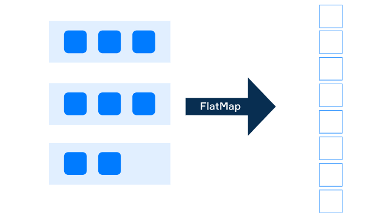

# Map and FlatMap

One of the most common tasks in programming is converting collections of objects to the new ones by applying the same function to each element in the collection. This task can be solved with a functional approach. Since you already know about Java Stream API, we are ready to take a closer look at the map and flatMap intermediate operations.

## The `map` operation
The `map` is a method of a `Stream` class that takes a one-argument function as a parameter. The main purpose of the `map` operation is to apply that function to each element of the stream and return a resulting stream that has the same amount of elements.

> Note that the map is an intermediate operation, which means that it returns a new stream.

Let's have a look at several examples where we can use the map operation:

1. One of the common uses of the `map` operation is applying a given function to each element of a stream of values. 

```java
List<Double> numbers = List.of(6.28, 5.42, 84.0, 26.0);
```

Let's divide each number by 2. For that, we can map each element of the stream to the element divided by 2 and collect it to the new list:

```java
List<Double> famousNumbers = numbers.stream()
        .map(number -> number / 2) // divide each number in the stream by 2
        .collect(Collectors.toList()); // collect transformed numbers to a new list
```

The resulting list is:

```
[3.14, 2.71, 42.0, 13.0]
```

> Note, the `map` method doesn't do any evaluations. Each number divided by 2 will be collected to the new `famousNumbers` list after calling `collect(Collectors.toList())` only.


2. `map` is often used to get a stream of properties from а stream of objects. For example, given a class `Job`:

```java
public class Job {
    private String title;
    private String description;
    private double salary;

    // getters and setters
}
```

We can get the list of job titles from a given list of jobs by using the map method:

```java
List<String> titles = jobs.stream()
        .map(Job::getTitle) // get title of each job
        .collect(Collectors.toList()); // collect titles to a new list
```
The code above will call the method `getTitle` of each `Job` object and collect the resulting list to the new one.

3. Another common use case is obtaining a list of some objects from the list of other objects. Let's assume we have the following classes:

```java
class User {
    private long id;
    private String firstName;
    private String lastName;
}

class Account {
    private long id;
    private boolean isLocked;
    private User owner;
}

class AccountInfo {
    private long id;
    private String ownerFullName;
}
```

And we would like to get a list of `AccountInfo` objects from a list of `Account` objects. We can do it by using the `map` method:

```java
List<AccountInfo> infoList = accounts.stream()
        .map(acc -> {
                AccountInfo info = new AccountInfo();
                info.setId(acc.getId());
                String ownerFirstName = acc.getOwner().getFirstName();
                String ownerLastName = acc.getOwner().getLastName();
                info.setOwnerFullName(ownerFirstName + " " + ownerLastName);
                return info;
        }).collect(Collectors.toList());
```

The code above will map each `Account` object to the new `AccountInfo` object and collect it to the new list of `AccountInfo` objects.

## Primitive-specialized types of the map operation

Primitive-specialized streams such as `IntStream`, `LongStream`, or `DoubleStream` also have the `map` method that maps the primitive value to another primitive of the same type. However, it is useful to have a way to map a primitive value to the object. For that primitive-specialized streams have a `mapToObj` method.

Let's consider an example where a class `Planet` is given:

```java
class Planet {
    private String name;
    private int orderFromSun;

    public Planet(int orderFromSun) {
        this.orderFromSun = orderFromSun;
    }
}
```

Now we can map `int` elements of the `IntStream` to the stream of objects using `mapToObj` method and collect the resulting stream to the list of `Planet` objects:

```java
List<Planet> planets = IntStream.of(1, 2, 3, 4, 5, 6, 7, 8)
        .mapToObj(Planet::new)
        .collect(Collectors.toList());
```

## The flatMap operation

The `map` operation works great for streams of primitives and objects, but the input can also be a stream of collections. For example, the method `stream()` of a `List<List<String>>` returns a `Stream<List<String>>`. In that case, we often need to flatten a stream of collections to a stream of elements from these collections.

>Flattening refers to merging elements of a list of lists to a single list. For example, if we flatten a `[["a", "b"], ["c"], ["d", "e"]]` list of lists, we will get `["a", "b", "c", "d", "e"]` list.

In such cases, a `flatMap` method can be useful. It takes and applies a one-argument function in order to transform each stream element into a new stream and concatenates these streams together.



Let's consider an example with java books. Each book has a title, a publishing year, and a list of authors:

```java
List<Book> javaBooks = List.of(
        new Book("Java EE 7 Essentials", 2013, List.of("Arun Gupta")),
        new Book("Algorithms", 2011, List.of("Robert Sedgewick", "Kevin Wayne")),
        new Book("Clean code", 2014, List.of("Robert Martin"))
);
```
Now we can obtain a list of all authors from the list of java books by using `flatMap` method:

```java
List<String> authors = javaBooks.stream()
        .flatMap(book -> book.getAuthors().stream())
        .collect(Collectors.toList());
```

The resulting list is:

```
["Arun Gupta", "Robert Sedgewick", "Kevin Wayne", "Robert Martin"]
```

## Conclusion

The `map` is an intermediate operation that allows us to apply a given one-argument function to each element of the stream and produce a new stream with the same number of elements. Primitive-specialized streams also have a `map` method that maps a stream primitive value to another primitive value of the same type. In addition to the `map`, primitive-specialized streams provide a `mapToObj` method that produces an object-valued stream. Java Stream API also provides a `flatMap` method that applies a given function that converts a stream element to the new stream and concatenates all obtained stream to a single one.
