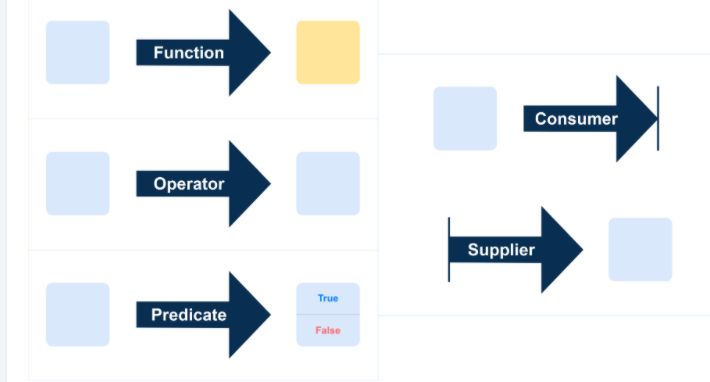

# Standard Functional Interfaces

You have already learned how to create and use functional interfaces. However, you don't have to create your own functional interface each time when you need it for a common use case. Instead, you could use built-in functional interfaces that were presented in Java 8 and can be found in the `java.util.function` package. In this topic, you will learn about the built-in functional interfaces, their types and naming conventions, and how to use them.

## Groups of functional interfaces

All functional interfaces that are presented in the `java.util.function` package can be divided into five groups:

- **functions** that accept arguments and produce results;
- **operators** that produce results of the same type as their arguments (a special case of function);
- **predicates** that accept arguments and return boolean values (boolean-valued function);
- **suppliers** that accept nothing and return values;
- **consumers** that accept arguments and return no result.



> Functional interfaces from the same group may differ in the number of arguments and be generic as well as non-generic.

## Naming convention

Thanks to the naming conventions of functional interfaces in the `java.util.function` package, you can easily understand an interface characteristic just by looking at its name prefix, which may indicate the following:

- a number of parameters that are accepted by an operation. The prefix `Bi` indicates that a function, a predicate, or a consumer accepts two parameters. Similarly to the `Bi` prefix, `Unary` and `Binary` prefixes indicate that an operator accepts one and two parameters respectively.
- a type of input parameters. `Double`, `Long`, `Int`, and `Obj` prefixes indicate the type of input value. For example, the `IntPredicate` interface represents a predicate that accepts the value of an `Integer` type.
- a type of output parameter. `ToDouble`, `ToLong`, and `ToInt` prefixes indicate the type of output value. For example, the `ToIntFunction<T>` interface represents a function that returns the value of an `Integer` type.


> Note, that some functional interfaces have combined prefixes. It simply means that you need to apply the listed rules considering each prefix. For example, looking at the prefixes of the `DoubleToIntFunction` interface, we can see that it accepts a value of `Double` type and returns a value of `Integer` type.

## Standard functional interfaces with examples
Let's look at examples for each of the five groups of the standard functional interfaces.

1. Functions

Each function accepts a value as a parameter and returns a single value. For example, the `Function<T, R>` is a generic interface that represents a function that accepts a value of type `T` and produces a result of type `R`.

```java
// String to Integer function
Function<String, Integer> converter = Integer::parseInt;
converter.apply("1000"); // the result is 1000 (Integer)

// String to int function
ToIntFunction<String> anotherConverter = Integer::parseInt;
anotherConverter.applyAsInt("2000"); // the result is 2000 (int)

// (Integer, Integer) to Integer function
BiFunction<Integer, Integer, Integer> sumFunction = (a, b) -> a + b;
sumFunction.apply(2, 3); // it returns 5 (Integer)
```


2. Operators

Each operator takes and returns the values of the same type. For example, `UnaryOperator<T>` represents an operator that accepts a value of type `T` and produces a result of the same type `T`.

```java
// Long to Long multiplier
UnaryOperator<Long> longMultiplier = val -> 100_000 * val;
longMultiplier.apply(2L); // the result is 200_000L (Long)

// int to int operator
IntUnaryOperator intMultiplier = val -> 100 * val;
intMultiplier.applyAsInt(10); // the result is 1000 (int)

// (String, String) to String operator
BinaryOperator<String> appender = (str1, str2) -> str1 + str2;
appender.apply("str1", "str2"); // the result is "str1str2"
```


3. Predicates

Each predicate accepts a value as a parameter and returns `true` or `false`. For example, the `Predicate<T>` is a generic interface that represents a predicate that accepts a value of type `T` and produces a `boolean`-valued result.

```java
// Character to boolean predicate
Predicate<Character> isDigit = Character::isDigit;
isDigit.test('h'); // the result is false (boolean)

// int to boolean predicate
IntPredicate isEven = val -> val % 2 == 0;
isEven.test(10); // the result is true (boolean)
```

4. Suppliers

Each supplier accepts no parameters and returns a single value. For example, `Supplier<T>` represents a supplier that accepts no arguments and returns a value of type `T`.

```java
Supplier<String> stringSupplier = () -> "Hello";
stringSupplier.get(); // the result is "Hello" (String)

BooleanSupplier booleanSupplier = () -> true;
booleanSupplier.getAsBoolean(); // the result is true (boolean)

IntSupplier intSupplier = () -> 33;
intSupplier.getAsInt(); // the result is 33 (int)
```

5. Consumers

Each consumer accepts a value as a parameter and returns no output. For example, the `Consumer<T>` is an interface that represents a consumer that accepts a value of type `T` and returns no result.

```java
// it prints a given string
Consumer<String> printer = System.out::println;
printer.accept("!!!"); // It prints "!!!"
```

## Conclusion

In this topic, we have observed a set of built-in functional interfaces that can be divided into five groups. Each of them can be used as a lambda expression or a method reference. It is important that input parameters and returning value of a lambda expression (or a method reference) correspond to the input parameters and returning value of a single abstract method presented in the functional interface. Also, we have observed the interface naming conventions and figured out how the name prefixes indicate the number of input parameters and the type of input and output values. Further, we will observe how to use generic and primitive-specialized standard functional interfaces together.