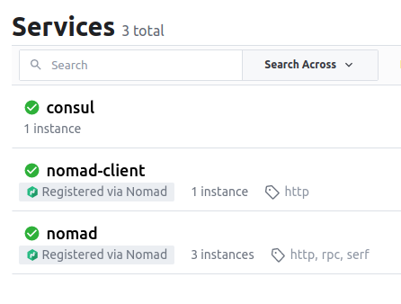
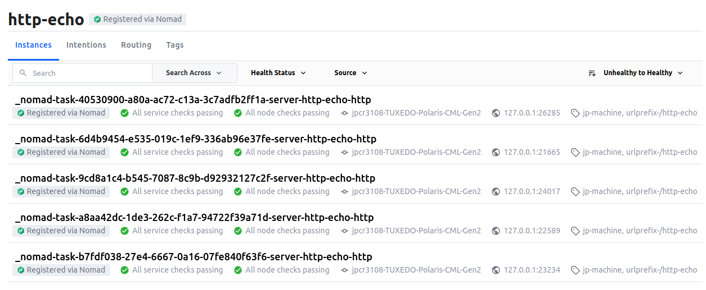

# 1. Creating a job

```hcl
job "http-echo" {
  datacenters = ["dc1"]
  group "echo" {
    count = 1
    task "server" {
      driver = "docker"
      config {
        image = "hashicorp/http-echo:latest"
        args  = [
          "-listen", ":8080",
          "-text", "Hello and welcome to 127.0.0.1 running on port 8080",
        ]
      }
      resources {
        network {
          mbits = 10
          port "http" {
            static = 8080
          }
        }
      }
    }
  }
}
```
In the example:
- The job is called `http-echo`
- The `docker` driver is used to run `count=1` instances of `hashicorp/http-echo`
- Arguments are passed to the container (Port to listen to and text to display)
- Resources requirements are set to be a network of 10mbits with an open port 8080 between host and container. Seeting `port "http" {}` makes port assignment dynamic

# 2. Scaling the job

By changing 
```hcl
count = 5
...
...
port "http" {}
```

The job will now create 5 instances of the `http-echo` application and dynamically assign free ports to each of them.

# 3. Running Consul with Nomad

In addtion to the `docker` driver, nomad provides these:
- `exec`: Execute a particular command for a task in the same OS as nomad is running
- `raw_exec`: Same as above but provides no resource isolation

```hcl
job "consul" {
  datacenters = ["dc1"]
  group "consul" {
    count = 1
    task "consul" {
      driver = "exec"
            
      config {
        command = "consul"
        args    = ["agent", "-dev"]
      }
      artifact {
        source = "https://releases.hashicorp.com/consul/1.10.3/consul_1.10.3_linux_amd64.zip"
      }
    }
  }
}
```
In the example:
- The `artifact` stanza allows to provide an URL to a zip file ,which will be downloaded and unzipped
- Consul is executed in dev mode
- Nomad automatically registers itself with a number of heath checks. See image below



# 4. Registering the `http-echo` as a service in Consul

- Nomad has built in support for consul using the `service` and `check` stanzas
- `service` allows to configure (among others) the name of the service and the port (using the port tag from earlier)
- `check` allows to define what health check should be performed by Consul to ensure the service is healthy

```hcl
job "http-echo-dynamic-service" {
  datacenters = ["dc1"]
  group "echo" {
    count = 5
    task "server" {
      driver = "docker"
      config {
        image = "hashicorp/http-echo:latest"
        args  = [
          "-listen", ":${NOMAD_PORT_http}",
          "-text", "Hello and welcome to ${NOMAD_IP_http} running on port ${NOMAD_PORT_http}",
        ]
      }
      resources {
        network {
          mbits = 10
          port "http" {}
        }
      }
      service {
        name = "http-echo"
        port = "http"
        tags = [
          "jp-linux",
          "urlprefix-/http-echo",
        ]
        check {
          type     = "http"
          path     = "/health"
          interval = "2s"
          timeout  = "2s"
        }
      }
    }
  }
}
```

In the example:
- The same port declared in resources as `"http"` is passed to the service stanza
- A healtehck of type `http` is used to verify the service. It will do a check every 2 seconds (`interval`) and wait 2 minutes for it to complete before thinking it failed
- Five instances of the service are deployed
- They are given port numbers dynamically
- The now appear in consul (with their port numbers)



  
*A load balancer can be user to "distribute" users on the five different deployed instances. Examples include [traefik](https://github.com/traefik/traefik) or [fabio](https://github.com/fabiolb/fabio). These can be run using nomad, and will employ strategies to give access to different of the deployed instances (round-robin for example). These applications connect with consul, (normally using tags like `urlprefix-/http-echo` for fabio) and are udpdated on changes on the infrastructure.*

# 5. Upgrading `http-echo` with a canary deployment

```hcl
job "http-echo-dynamic-service" {
  datacenters = ["dc1"]
  group "echo" {
    count = 5
    update {
      canary       = 1
      max_parallel = 5
    }
    task "server" {
      driver = "docker"
      config {
        image = "hashicorp/http-echo:latest"
        args  = [
          "-listen", ":${NOMAD_PORT_http}",
          "-text", "Update successful!\n\nHello and welcome to ${NOMAD_IP_http} running on port ${NOMAD_PORT_http}",
        ]
      }
      resources {
        network {
          mbits = 10
          port "http" {}
        }
      }
      service {
        name = "http-echo"
        port = "http"
        tags = [
          "jp-linux",
          "urlprefix-/http-echo",
        ]
        check {
          type     = "http"
          path     = "/health"
          interval = "2s"
          timeout  = "2s"
        }
      }
    }
  }
}
```
In the example:
- The `update` stanza was used with the following parameters:
  - `canary = 1` means start up 1 canary instance of the new version (more are possible)
  - `max_parallel = 5` specifies the number of allocations within a task group that can be updated at the same time once we confirm our canary instance works as intended. In this case, is all of the instances
- The message displayed in the app was changed in order to trigger an update
- Once the canary works, nomad can "promote" it and the changes in all five will take place and the canary instance eliminated
