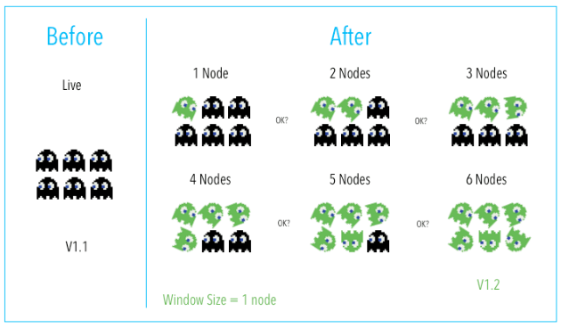
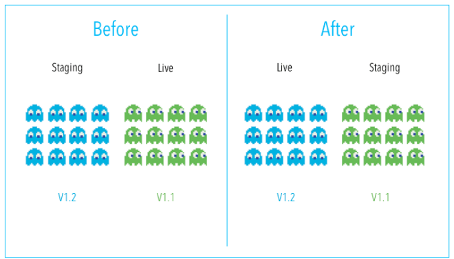
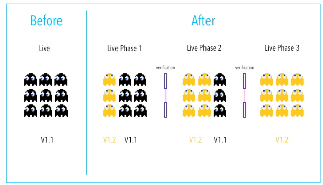

# Upgrading an application

Nomad supports different update strategies, all trough the `update` stanza:

## Rolling Upgrades

- A defined number of instances are restarted with a new version of the application. 
- Once they are in a healthy state, another set of the same defined number of instances are restarted with the new version, and so on until all instances have been updated. 
- Nomad will revert to an older, healthy job if a deployment fails.

## Blue/Green Deployment

- Have two different deployments (two instances)
- One is always active (green, production) and one sitting idle (blue or staging)
- Updates are made on the blue instance and then trafic is routed there (turning it green)

## Canary

- Releases an application or service incrementally to a subset of users.
- We install the update in our systems and split the users into two groups. A small percentage of them will go to the canary while the rest stay on the old version, as a control.
- As feedback and problems are taken into account, more servers get the canary version

