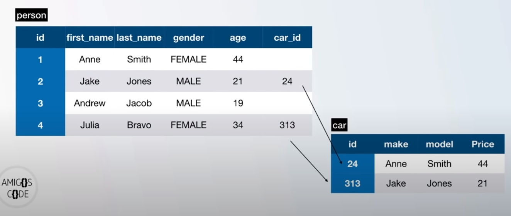

# What is a database

Place where you can 
- Store
- Manipulate
- Retrieve

data

Postgress is the database
Relationa


SQL is a language to speak to the the database
exa
```sql
SELECT column FROM table_name
```


Data stored i tables
has rows and colums
row: data inside the tables
column: fields

Relational database
  Relation between one or more tables
  
  Information is split into different tables and a relation is created

PostgreSQL
  Open Source


# Commands

Once inside `psql` or `pgcli`
- `\?` gives me all available backlash commands
- `\q` allows me to quit
- `\l` lists all the databases


*lowercase and uppercase dont matter*

```sql
CREATE DATABASE waa;
```

To access it can either be in the command line
```bash
pgcli -h localhost -p 5432 -u user -d database
```
Or inside postgres with `\c database`


Create db: `CREATE DATABASE name;`
Delete (dangerous): `DROP DATABASE name;`
```sql
CREATE TABLE table_name (
  Column_name + data_type + constraints,
)
```
Datatypes can be found [here](https://www.postgresql.org/docs/current/datatype.html)
E.g.
```sql
CREATE TABLE person (
  id int,
  first_name VARCHAR(50),
  birthday TIMESTAMP
)
```

To show all tables, we can use `/d` as describe of `/d name` to describe a table