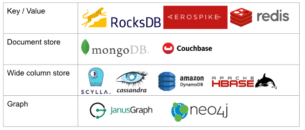
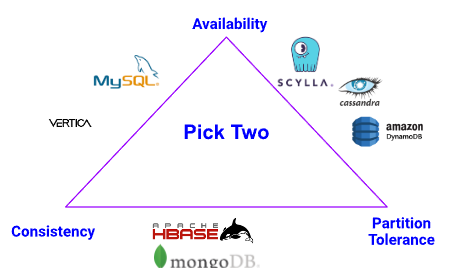

title: Introduction
parent: ScyllaDB
---

- Scylla is a NoSQL Database
- Focused on high troughput (data in and out), low latency and high availability
- Drop in replacement for apache cassandra, but written in C++ so much faster
- Specially fitted for use cases with:
  - Lots of data
  - High availability needs
  - Real time apps (very fast rw)
  - High performance

- Works in a cluster and replicates data according to user defined parameters

# NoSQL

Databases that provide a mechanism for storing and retrieving data that is modeled different than tabular relations in relational databases. 

THey can be classified according to the model they use:

Another way to classify NoSQL databases is according to the CAP theorem (or Brewer’s theorem):

- Consistency guarantees that every read receives the most recent write or an error
- Availability guarantees that every request receives a non-error response. (Note that here there is no guarantee that the response contains the most recent write)
- Partition Tolerance guarantees that the system continues to operate even when the network drops some messages or there are network failures.

